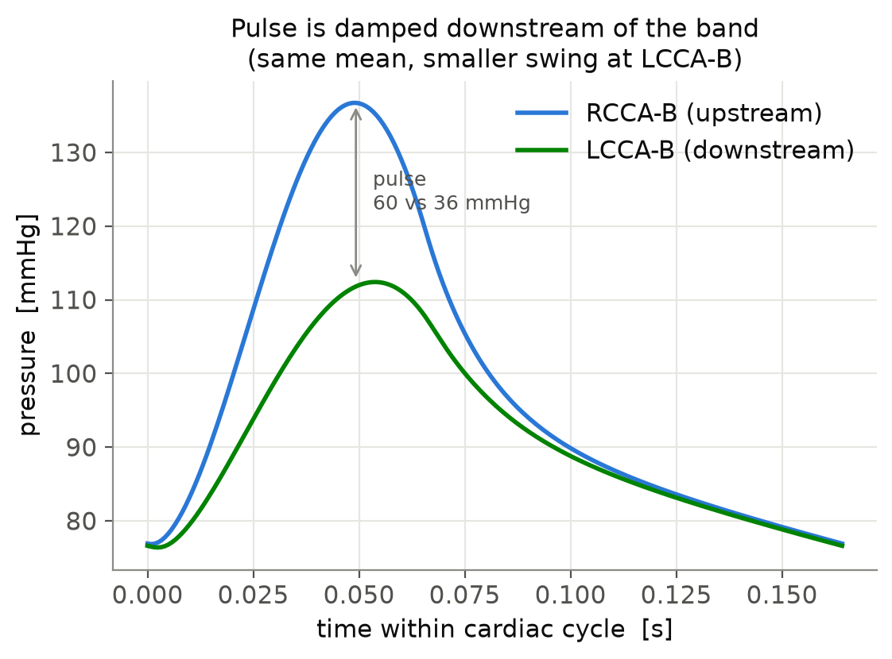
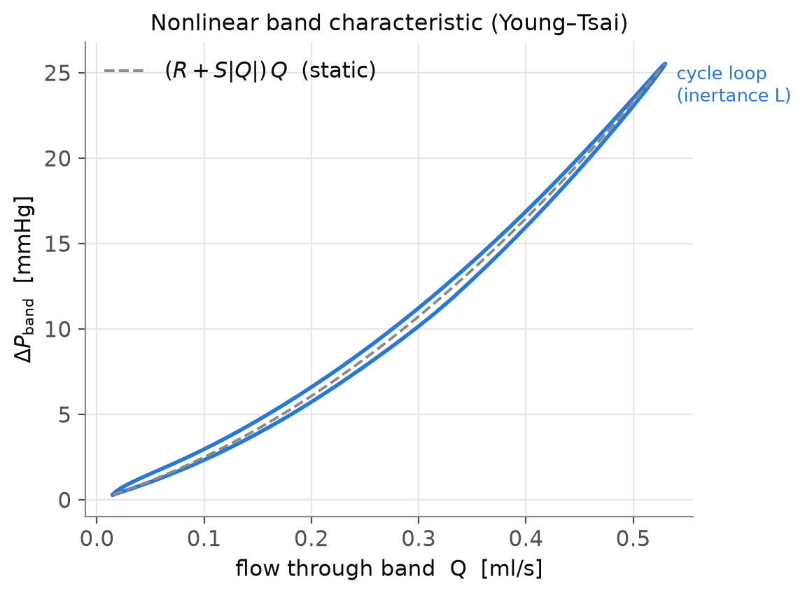

# Eberth aortic-banding pulsatile model — setup & parameters

Model card for the three configs in this folder — **pre-banding**
[`eberth_aortic_band_prebanding.json`](./eberth_aortic_band_prebanding.json),
**acute** [`eberth_aortic_band_acute.json`](./eberth_aortic_band_acute.json), and
**chronic** [`eberth_aortic_band_chronic.json`](./eberth_aortic_band_chronic.json).
All three are generated by `make_configs.py` from the **same** literature-sourced
physiological parameters. Pre-banding has a normal (unobstructed) arch; acute and
chronic add the **same** calibrated band and differ only in carotid-wall geometry
(acute = baseline CCA both sides; chronic = Table-1 remodeled). See §7 for the
three-state comparison and §8 for the full parameter provenance and calibration.

> **Note on sections §1–§6:** the topology, block mapping, and units are shared
> by both configs. The *concrete parameter/result numbers* in §3–§4 below are from
> an **earlier illustrative version** and are kept for pedagogy; the **canonical,
> physiological values are in §8** (and in the JSON `parameter_tags`).

## 1. Problem setup

Eberth et al. (2009, *J. Hypertens.* **27**:2010–2021) placed a stiff band
(~406 µm spacer) on the aortic arch of mice, **between** the innominate/right
common carotid takeoff and the left common carotid takeoff. This creates two
carotid arteries at nearly the same mean pressure and flow but with very
different **pulsatility**:

- **RCCA-B (right common carotid)** — sits **upstream** of the band, between the
  heart and the stenosis. It sees the full forward pulse plus reflections, so its
  pulsatility rises (PI ≈ 3.11 vs 1.16 baseline).
- **LCCA-B (left common carotid)** — sits **downstream** of the band. The
  resistive–inertial band damps the pulse, so its pulsatility stays near normal
  (PI ≈ 1.65).

The modeling goal is a reduced-order (0D) pulsatile blood-flow model that
reproduces this **redistribution of pulsatility** (high upstream, damped
downstream) with the **band as the only structural difference** between the two
carotids — the key qualitative test.

### Circuit (electric analogy: pressure ↔ voltage, flow ↔ current)

```
                              RCCA-B (right head)      LCCA-B (left head)
                                    │ RCR                    │ RCR
   Qin(t)   aortic     Ra La Ca     │                        │      Ro Lo
   ┌───┐    valve   ┌────────────┐  A   ΔP_band(Q)   ┌────┐  B  ┌──────────────┐   systemic
   │ ⊕ │──▷|──────▶ │ asc. aorta │──┴──▷/\/\/──────▶ │band│──┴─▶│ desc. aorta  │──▶ RCR load
   └───┘            └────────────┘        BAND       └────┘     └──────────────┘
```

- **Node A** is upstream of the band → stays pulsatile.
- **Node B** is downstream of the resistive–inertial band → damped.

### Governing relations

Each vessel is a resistor–capacitor–inductor (RCL) segment:

- mass conservation on a compliant chamber: `C dP/dt = Q_in − Q_out`
- momentum balance on an R–L segment: `L dQ/dt = P_in − P_out − R·Q`

The **band** is *not* a linear resistor. It uses svZeroDSolver's `BloodVessel`
stenosis term, whose law

```
ΔP_band = (R + S·|Q|)·Q + L·dQ/dt
```

is exactly the Young–Tsai form (Eq. 6 of the note): the viscous `R·Q` term, the
Bernoulli/turbulent `S·|Q|·Q` term with

```
S = K_t · ρ / (2·A₀²) · (A₀/A_s − 1)²   (svZeroD `stenosis_coefficient`)
```

and the inertial `L·dQ/dt` term. The band geometry (throat D_s ≈ 406 µm, aortic
lumen D₀ ≈ 875 µm) gives an area ratio A_s/A₀ ≈ 0.21 — a ~78 % area stenosis.

## 2. Units

Consistent **mmHg / ml / s**:

| Quantity | Unit |
|----------|------|
| Pressure | mmHg |
| Flow (Q) | ml/s |
| Time     | s |
| Resistance R | mmHg·s/ml |
| Capacitance C | ml/mmHg |
| Inductance L | mmHg·s²/ml |
| `stenosis_coefficient` S | mmHg·s²/ml² |

## 3. Parameters used in the JSON

> ⚠️ **Illustrative mouse-scale values**, chosen to be physiologically plausible
> and to run — **not** a calibrated fit to the Eberth data. See §5.

### 3.1 Simulation parameters

| Key | Value | Meaning |
|-----|-------|---------|
| `number_of_cardiac_cycles` | 20 | cycles run (to reach periodic steady state) |
| `number_of_time_pts_per_cardiac_cycle` | 201 | time samples per cycle |
| `output_all_cycles` | `false` | write only the last (converged) cycle |
| `steady_initial` | `true` | initialize from a steady solve |
| `absolute_tolerance` | 1e-9 | Newton solver tolerance |

### 3.2 Inflow waveform (heart) — `INFLOW`, `FLOW` BC

| Property | Value |
|----------|-------|
| Cardiac period T | 0.15 s (≈ 6.7 Hz) |
| Systolic ejection duration T_s | 0.06 s |
| Waveform | half-sine `Q = Q_peak·sin(π t/T_s)` for `t ≤ T_s`, else 0 (diastole) |
| Peak flow Q_peak | 0.80 ml/s |
| Mean flow | ≈ 0.20 ml/s (mouse cardiac output) |

### 3.3 Aortic valve — `aortic_valve`, `ValveTanh`

| Parameter | Value | Note |
|-----------|-------|------|
| `Rmax` | 1.0e5 | closed (diode blocks backflow) |
| `Rmin` | 1.0 | open |
| `Steepness` | 1.0 | sigmoid steepness [1/mmHg] |
| `upstream_block` | `aortic_root` | |
| `downstream_block` | `ascending_aorta` | |

### 3.4 Vessels (`BloodVessel` blocks)

| id | name | length | R_poiseuille | C | L | stenosis_coeff | inlet | outlet |
|----|------|-------:|-------------:|----:|----:|---------------:|-------|--------|
| 0 | `aortic_root` | 2.0 | 0.5 | — | 0.005 | — | `INFLOW` | (→ valve) |
| 1 | `ascending_aorta` | 5.0 | 1.0 | 5.0e-4 | 0.02 | — | (valve →) | node A |
| 2 | `rcca_b` | 5.0 | 1.0 | — | — | — | node A | `RCR_RIGHT` |
| 3 | `aortic_band` | 1.0 | 1.0 | — | 0.03 | **80.0** | node A | node B |
| 4 | `lcca_b` | 5.0 | 1.0 | — | — | — | node B | `RCR_LEFT` |
| 5 | `descending_aorta` | 8.0 | 1.0 | 5.0e-4 | 0.02 | — | node B | `RCR_SYS` |

`C` gives node compliance (Ca on ascending aorta, Cb on descending aorta / node
B). The band (id 3) is the only nonlinear element — its `stenosis_coefficient`
and `L` set the pulse damping.

### 3.5 Junctions (`NORMAL_JUNCTION`)

| name | inlet vessels | outlet vessels | represents |
|------|---------------|----------------|------------|
| `node_A` | [1] (ascending aorta) | [2, 3] (RCCA-B, band) | right carotid takeoff, upstream of band |
| `node_B` | [3] (band) | [4, 5] (LCCA-B, desc. aorta) | left carotid takeoff, downstream of band |

### 3.6 Terminal beds — RCR (Windkessel) boundary conditions

| name | Rp | C | Rd | Pd | represents |
|------|---:|---:|---:|---:|-----------|
| `RCR_RIGHT` | 500 | 1.0e-5 | 4500 | 0 | right head (RCCA-B bed) |
| `RCR_LEFT` | 500 | 1.0e-5 | 4500 | 0 | left head (LCCA-B bed) — **identical to right** |
| `RCR_SYS` | 50 | 1.0e-3 | 450 | 0 | descending aorta / systemic load |

The right and left beds are **deliberately identical** so that the band is the
only inter-carotid difference. `RCR_SYS` has much lower resistance because it
carries the bulk of cardiac output. `Pd = 0` makes MAP ≈ (Rp+Rd)·Q̄.

## 4. Result with these parameters

Running the file produces the expected asymmetry (last converged cycle):

| Node | Bed | MAP (mmHg) | Pulse pressure (mmHg) | Q̄ (ml/s) |
|------|-----|-----------:|----------------------:|----------:|
| A — RCCA-B (upstream)   | right head | ~88 | **~26** (104→78) | ~0.018 |
| B — LCCA-B (downstream) | left head  | ~84 | **~13** (91→78)  | ~0.017 |

The band damps the pressure pulse ~2× across it, MAP stays similar, and mean
carotid flows land in the paper's 0.012–0.022 ml/s range. The **direction** is
correct (upstream more pulsatile than downstream).

## 5. Figures

The figures below are generated from the **calibrated chronic model**
(`eberth_aortic_band_chronic.json`, `stenosis_coefficient = 53.8`; see §8).
Regenerate all figures (into `examples/figures/`) with:

```bash
uv run python examples/make_figures.py
```

| File | What it shows |
|------|---------------|
| `figures/fig1_pressure_waveforms.png` | Pressure over one cycle at RCCA-B (upstream) vs LCCA-B (downstream) — the pulse is damped downstream at the same mean. |
| `figures/fig2_carotid_flow_waveforms.png` | Carotid flow waveforms — CCA (pre-banding baseline, dashed) vs banded RCCA-B / LCCA-B (the quantity behind the paper's PI). |
| `figures/fig3_band_deltaP_Q.png` | Nonlinear band characteristic ΔP_band vs Q — quadratic Young–Tsai curve with the inertance (`L`) hysteresis loop. |
| `figures/fig4_PI_validation.png` | Pulsatility index by location, model vs Eberth Table 1 targets. |
| `figures/fig5_pressure_envelope.png` | Systolic/diastolic/mean pressure along the aortic path — pulse pressure collapses across the band, MAP stays ~flat. |
| `figures/fig6_severity_sweep.png` | Sensitivity: PI upstream vs downstream as band severity (`stenosis_coefficient`) is swept. |
| `figures/fig7_state_comparison.png` | Three-state comparison (pre-banding → acute → chronic): carotid **pressure** is symmetric before banding, splits immediately on banding, and barely changes with remodeling. |
| `figures/fig8_flow_state_comparison.png` | Same three-state comparison for carotid **flow**: symmetric pre-banding, then upstream RCCA gains a sharper peak + diastolic dip while downstream LCCA is damped. |




## 6. Calibration to the paper (validation targets)

These values are a starting point, **not** a fit. To match Table 1 of Eberth:

- **Targets:** PI_RCCA-B ≈ 3.11, PI_LCCA-B ≈ 1.65 (baseline CCA ≈ 1.16), with
  MAP similar across beds and Q̄ ≈ {0.016 (CCA), 0.022 (RCCA-B), 0.012 (LCCA-B)}.
  PI = (v_max − v_min)/v_mean.
- **Tune:** the band `stenosis_coefficient` and `L` (calibrate against the paper's
  ΔP = 4·v²_jet regression → K_t); the three RCR beds (mean flow split + MAP);
  and the ejection waveform (heart rate ~6.09 Hz banded vs 7.17 Hz baseline).
- **Tools:** `tests/cases/steadyFlow_calibration.json` and the `svZeroDTuner`
  application (`applications/svZeroDTuner`) for automated parameter estimation.

## 7. Acute vs. chronic — two model variants

Eberth measured hemodynamics **and** geometry **5 or 8 weeks after banding**,
timing chosen to capture a *"nearly steady state adaptive response"* (paper,
Introduction & Methods). So the Table-1 PI (RCCA-B 3.11, LCCA-B 1.65) and the
Table-1 carotid geometry are the **chronic, post-remodeling** values — **not**
the acute post-operative state. RCCA-B is measurably wider (633 vs 496 µm ID)
and ~3.5× thicker-walled (88 vs 25 µm) than baseline.

All three files are built by `make_configs.py` from the **same physiological
parameters**. Pre-banding has a normal arch (no stenosis); acute and chronic add
the **same calibrated band** (`stenosis_coefficient = 53.8`) and differ only in
carotid-wall geometry:

| File | Arch A→B | Carotid walls | Represents |
|------|----------|---------------|------------|
| `eberth_aortic_band_prebanding.json` | **normal arch** (S=0) | baseline CCA, both sides | **healthy control** before surgery |
| `eberth_aortic_band_acute.json` | band (S=53.8) | baseline CCA, both sides | **acute** redistribution — the immediate *stimulus* |
| `eberth_aortic_band_chronic.json` | band (S=53.8) | **Table-1 remodeled** | **chronic** 5–8-week state — stimulus *plus* wall adaptation |

The band spacer is the same physical object post-surgery, so the stenosis was
calibrated once (on the chronic geometry, to the chronic Table-1 PI ratio) and
reused for the acute config; the acute PI is therefore a **prediction**.

### Key result — the band, not the remodeling, sets the split

| | RCCA(-B) PI | LCCA(-B) PI | PP R / L (mmHg) |
|---|---:|---:|---:|
| **Pre-banding** (symmetric) | 2.09 | 2.05 | 42 / 41 |
| **Acute** (baseline carotids) | 2.85 | 1.60 | 60 / 36 |
| **Chronic** (remodeled carotids) | 2.88 | 1.53 | 60 / 36 |
| Paper Table 1 | 1.16 (CCA) → 3.11 / 1.65 | | 42 → 56 / 27 |

Two things fall out. **(1)** Pre-banding is symmetric (both carotids equal) with
pulse pressure ~42 mmHg — matching the paper's baseline CCA (42.5) — and banding
immediately splits it. **(2)** The acute and chronic states are **nearly
identical**: the ~3.5× RCCA-B wall thickening barely changes local pulsatility,
because the carotid wall compliance (~1e-6 ml/mmHg) is tiny next to the
aortic-buffer and RCR-bed compliances. So the pulsatility asymmetry is driven
**almost entirely by band position**, present **immediately** on banding — the
wall remodeling is the *response* to that pulsatile stimulus, not its cause,
exactly as Eberth argue.

## 8. Chronic model — physiologically parameterized + calibrated (`eberth_aortic_band_chronic.json`)

This is the quantitative working model. Every vessel `R`, `C`, `L` is **computed
from researched mouse geometry and wall stiffness** via Eq. (1)–(3) (with CGS→
mmHg·ml·s unit conversion), and every parameter carries a tag in the JSON's
`description.parameter_tags`. Rebuild with `python examples/make_configs.py`;
recalibrate with `uv run python examples/calibrate_stenosis.py examples/eberth_aortic_band_chronic.json --write`.

### Parameter provenance — FIXED / DERIVED / CALIBRATE

| Parameter | Value | Tag | Source |
|-----------|-------|-----|--------|
| Blood density ρ | 1.06 g/cm³ | FIXED | Aslanidou 2016 |
| Blood viscosity μ | 3.5 cP | FIXED | Windberger 2003 (high-shear) |
| Aortic wall modulus E | 1.0 MPa | FIXED | Wagenseil 2019 / Bersi |
| Carotid wall modulus E | 1.5 MPa | FIXED | Ferruzzi 2013 (systolic) |
| Heart rate | 6.09 Hz | FIXED | Eberth 2009 (banded) |
| Cardiac output | 0.20 ml/s (12 ml/min) | FIXED | Aslanidou 2016 (anesthetized) |
| MAP target | 90 mmHg | FIXED | Constantinides 2011 |
| Carotid ID / wall (RCCA-B, LCCA-B) | 633/88.1, 482/41.6 µm | FIXED | Eberth 2009 Table 1 |
| Aorta ID (asc/desc), wall | 1.4 / 0.9 mm, 40 µm | FIXED | Casteleyn 2010, Guo & Kassab 2002 |
| Segment lengths (carotid ~7 mm, band ~0.5 mm) | — | FIXED* | literature-guided **estimate** |
| Vessel `R`, `L` + carotid `C` | computed | **DERIVED** | Eq. (1)–(3) from geometry + E |
| Aortic buffer compliance `Ca`/`Cb` | 1.7e-4 / 1.0e-4 (Σ 2.67e-4) | FIXED | Aslanidou 2016 measured central aortic compliance (per-segment geometric C underestimates it ~20×) |
| Band viscous `R`, inertial `L` | 19.7, 0.031 | **DERIVED** | throat geometry (Young–Tsai) |
| RCR beds (Rp, C, Rd) | MAP/Q split 10/90, τ=RdC | **DERIVED** | flow split Feintuch 2007 / Trachet 2009 |
| Ejection systolic fraction | 0.40 | **CALIBRATE** | assumed waveform shape |
| Valve (Rmax, Rmin, Steepness) | 1e5, ~1, 1 | FIXED | assumed diode (not in paper) |
| **Band `stenosis_coefficient`** | **53.8** (geom. prior 219) | **CALIBRATE** | tuned to the PI ratio |

### Calibration of the stenosis coefficient

The paper's `PI = (v_max − v_min)/v_mean` equals the flow-based PI for a fixed
cross-section, so we match the carotid segment flow PI. **A single
`stenosis_coefficient` cannot match both absolute PIs**: raising S *increases* the
upstream RCCA-B PI (wave reflection — exactly what the paper describes) while
*lowering* the downstream LCCA-B PI, and forcing the absolute values drives MAP
non-physiological. The band's physical role is the **relative split**, so S is
calibrated to the **PI ratio** (`3.11/1.65 = 1.885`) under a MAP guard.

**Result: S\* = 53.8** →

| | Paper Table 1 | model (S=53.8) |
|---|---:|---:|
| PI ratio (RCCA-B / LCCA-B) | 1.885 | **1.885** ✓ |
| flow-PI RCCA-B | 3.11 | **2.88** (−7%) |
| flow-PI LCCA-B | 1.65 | **1.53** (−7%) |
| pulse pressure RCCA-B | 56.3 | **60** mmHg ✓ |
| pulse pressure LCCA-B | 26.7 | **36** mmHg |
| Psys / Pdia RCCA-B | 124 / 68 | 137 / 77 |
| Psys / Pdia LCCA-B | 95 / 68 | 112 / 76 |
| MAP RCCA-B / LCCA-B | similar | 98 / 91 mmHg ✓ |
| Q̄ RCCA-B / LCCA-B | 0.022 / 0.012 | 0.0184 / 0.0168 ml/s (right direction) |

Both flow-PIs now land within ~7% of Table 1 and RCCA-B pulse pressure is nearly
exact. This required one correction beyond the stenosis: the aortic windkessel
compliance `Ca`/`Cb` was raised from the ~20×-too-small per-segment geometric
value to the **measured** central aortic compliance (2.67e-4 ml/mmHg, Aslanidou
2016) — without it the sharp ejection was unbuffered and PP/PI ran ~2× high. The
stenosis coefficient barely moved (58 → 53.8), so the ratio calibration is robust
to that change. Residual discrepancies (LCCA-B pressures somewhat high, diastole
~10 mmHg high) would tighten further by tuning the LCCA-B/systemic flow split and
the ejection contour — neither of which is the stenosis parameter.
